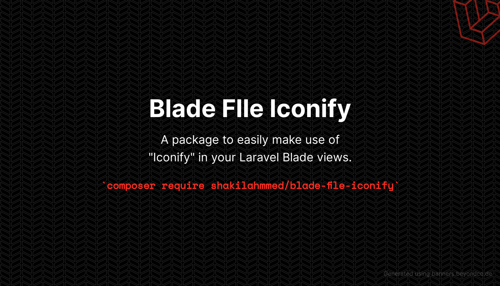

<p align="center">
    
</p>

# Blade File Icons

A package to easily make use of [Iconify](https://github.com/iconify) in your Laravel Blade views.

For a full list of available icons see [the SVG directory](resources/svg).

## Requirements

- PHP 7.4 or higher
- Laravel 8.0 or higher

## Installation

```bash
composer require shakilahmmed/blade-file-iconify
```

## Updating

Please refer to [`the upgrade guide`](UPGRADE.md) when updating the library.

## Configuration [Must Needed]
```bash
php artisan vendor:publish --tag=blade-file-iconify
```

```bash
php artisan icon:cache
```

## Usage

Icons can be used as self-closing Blade components which will be compiled to SVG icons:

```blade
<x-fileicon-ada/>
```

You can also pass classes to your icon components:

```blade
<x-fileicon-ada class="w-6 h-6 text-gray-500"/>
```

And even use inline styles:

```blade
<x-fileicon-ada style="color: #555"/>
```

### To Update Icons from Iconify

```bash
php artisan app:save-icons
```

### Raw SVG Icons

If you want to use the raw SVG icons as assets, you can publish them using:

```bash
php artisan vendor:publish --tag=blade-file-iconify --force
```

Then use them in your views like:

```blade

```

## Changelog

Check out the [CHANGELOG](CHANGELOG.md) in this repository for all the recent changes.

## Maintainers

Blade File Iconify is developed and maintained by [Shakil Ahmmed](https://github.com/ShakilAhmmed).

## License

Blade File Icons is open-sourced software licensed under [the MIT license](LICENSE.md).
